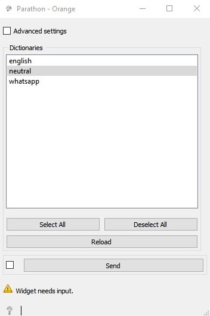
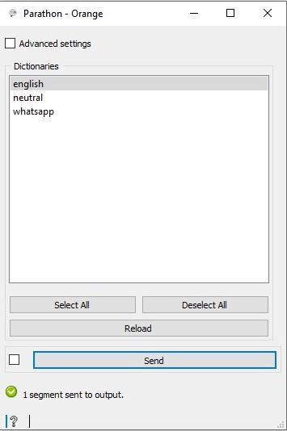
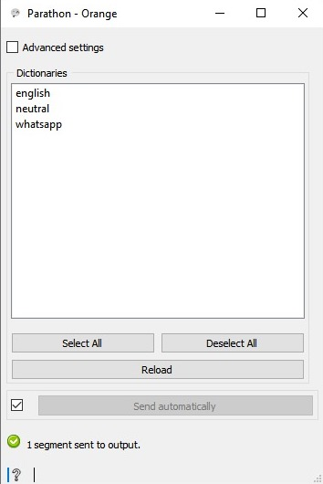
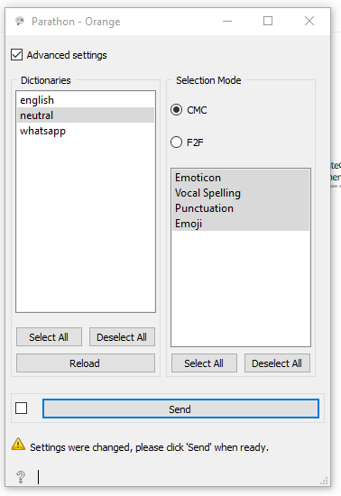
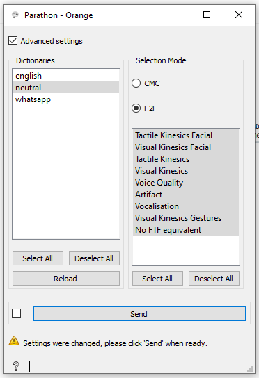

.. meta::
   :description: Orange3 Textable Prototypes documentation, Parathon widget
   :keywords: Orange3, Textable, Prototypes, documentation, Parathon, widget

.. _Parathon:

Parathon
=======

Author
------

Zakari Rabet, Joël Huck, Lara Lambelet and Mathieu Perring.

Signals
-------

Inputs:

* ``Segmentation``

  A Textable segmentation containing words.

Outputs:

* ``Segmented data``

  A Textable segmentation containing the same words annotated with the discovered paratextual elements.

Description
-----------

The widget is based on a Python package created by Sorcha Walch that you can find at GitHub : https://github.com/sorchawalsh/parathon.git.

This widget takes a segmentation as input and applies dictionaries. The dictionaries are lists of regexes. 
The widget annotates the input text and extract the paralinguistic elements specific to digital communication, while relating them to the paralinguistic features present in face-to-face communication.

Interface
~~~~~~~~~

User controls are divided into three main sections: **Dictionaries**, **Advanced settings**, and **Selection Mode**.

.. _parathon_fig1:

If no input has been connected, the parathon widget cannot work. It sends an error, **Widget needs input**.

.. _parathon_fig2:

After connecting a Textable widget as an input, the user can start using the parathon widget.
The minimal window, presents the **Dictionaries** section, in which the user can select one or 
more dictionaries found in json files. These dictionaries are composed of regex lists.

**Select All** selects all dictionaries. **Deselect All** deletes all previously selected dictionaries.
**Reload** allows the user to update the selection that will be processed if there are any changes before starting the processing.
**Send** initiates the widget process and sends the result to the output. The result is a segmentation. A message of confirmation appears, **i segment sent to output**.
In this minimal window, the checkbox to go to **Advanced settings** section is displayed. 

.. _parathon_fig3:

This figure shows how it appears if the user selected **Send automatically**.

.. _parathon_fig4:

**Advanced settings** section has been selected. On the left part of the section, one can select one or more dictionaries. 
When a dictionary is selected, the part on the right, i.e. the **Selection Mode** section changes according to the selected dictionary.
**Selection Mode** presents the two paralinguistic categories **CMC** and **F2**. **CMC** means Computer-Mediated Communication and **F2F** means Face-to-Face.
One can select either one, and then opt for a more advanced analysis by selecting sub-elements within each one that depend on each dictionary.

The sub-elements include:

**CMC**
====================       =====
Code                       Type
=====================      =====
*VSP*                      *Vocal spelling*
*PUN*                      *Punctuation*
*EMJ*                      *Emoji*
*EMT*                      *Emoticon*
=====================      =====

**F2F**
====================       =====
Code                       Type
=====================      =====
*TK*                       *Tactile Kinesics*
*VKG*                      *Visual Kinesics Gestures*
*VKF*                      *Visual Kinesics Facial*
*VS*                       *Vocalisation*
*VQ*                       *Voice Quality*
*A*                        *Artifact*
*NoFTF*                    *No FTF equivalent*
=====================      =====

For more information, check the rapport_final.pdf that can be find at the following adress: https://github.com/sorchawalsh/parathon.git.

Figure 4, shows exemple of **CMC** sub-elements for the **neutral** dictionary.

.. _parathon_fig5:

Figure 5, shows exemple of **F2F** sub-elements for the **neutral** dictionary.
In this case, all sub-elements are selected. This does not have to be the case. 
The **Deselect All**, **Select All** and **Reload** commands also work in the **Selection Mode** section.
If the user chooses a category, for example, **CMC**, and selects a few sub-elements, the result will only show 
the elements of that choice. It is only possible to select one category and not both.
If one wants both categories, then one should stay in the minimal version where one chooses only the dictionaries. 

Messages
---------

Information
~~~~~~~~~~~

*<n> segments sent to output.*
    This confirms that the widget has operated properly.

Warnings
~~~~~~~~

*Input has changed, please click 'Send' when ready.*
    Input has changed but the **Send automatically** checkbox
    has not been selected, so the user is prompted to click the **Send**
    button (or equivalently check the box) in order for computation and data
    emission to proceed.

*Widget needs input.*
    The widget instance is unable to process because it has no input.

*Processing, please wait...*
   The data has been sent. The widget is doing its processing to output the result.

Errors
~~~~~~

*Couldn't open file.*
    An error has prevented the widget to open to uploaded file.

*Unvalid interaction.*
    An error prevented the widget from connecting to another widget.

*"ERROR: language file could not be found. Analysing with neutral dictionary.*
    An error has prevented the widget to access the language of the input text. The neutral dictionary is chosen automatically.

*ERROR: mode dictionary could not be found. Analysing with neutral dictionary.*
    An error has prevented the widget to work because no dictionary has been selected, so the neutral dictionary is used. 

