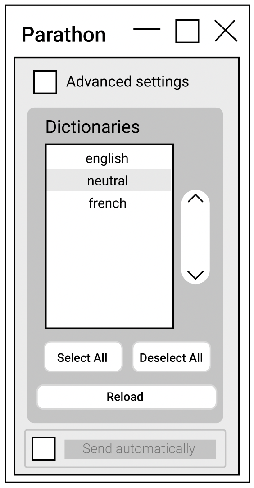
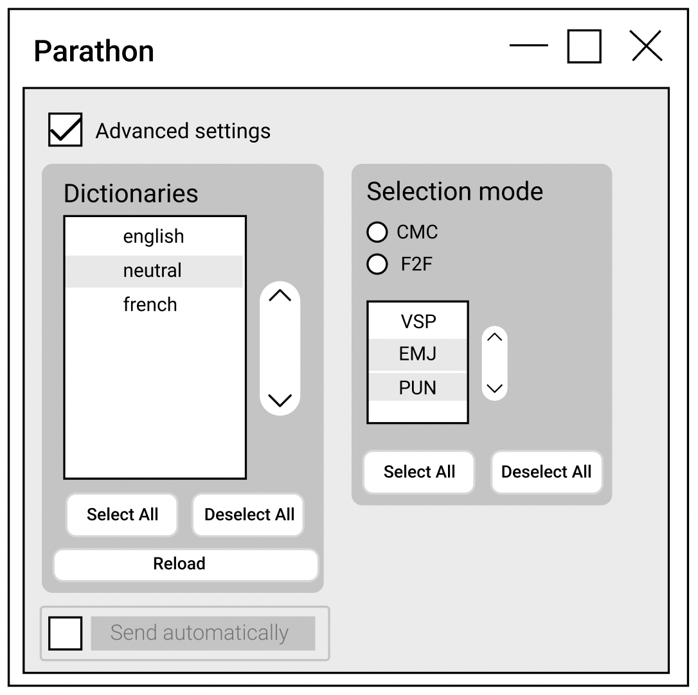

######################################
Spécification widget Parathon
######################################

1 Introduction
**************

1.1 But du projet
=================
Créer un widget pour Orange Textable (v3.1.11) permettant d'analyser un texte et en sortir les éléments paratextuels.

1.2 Aperçu des étapes
=====================
* Première version de la spécification: 24 mars 2022
* Remise de la spécification: 31 mars 2022
* Version alpha du projet: 5 mai 2022
* Remise et présentation du projet: 1er juin 2022

1.3 Equipe et responsabilités
==============================

* Lara Lambelet (`lara.lambelet.1@unil.ch`_):

.. _lara.lambelet.1@unil.ch: mailto:lara.lambelet.1@unil.ch

	- spécification
	- interface
	- logo
	- documentation

* Joël Huck (`joel.huck@unil.ch`_):

.. _joel.huck@unil.ch: mailto:joel.huck@unil.ch

	- code
	- tests
	
* Matthieu Perring (`matthieu.perring@unil.ch`_) :

.. _matthieu.perring@unil.ch: mailto:matthieu.perring@unil.ch

	- code
	- tests

* Zakari Rabet (`Zakari-Yacine.Rabet@unil.ch`_):
.. _Zakari-Yacine.Rabet@unil.ch: mailto:Zakari-Yacine.Rabet@unil.ch

	- code
	- GitHub
	- tests

2. Technique
************

2.1 Dépendances
===============

* Orange 3.31

* Orange Textable 3.1.11

2.2 Fonctionnalités minimales
=============================

* Prendre une segmentation en Input.

* Permettre de choisir un ou plusieurs dictionnaires de regex à appliquer au texte.

* Bouton Select All permet de sélectionner tous les éléments.

* Bouton Deselect All permet de désélectionner tous les éléments.

* Bouton Reload permet de mettre à jour s'il y a eu une modification dans la sélection ou désélection des dictionnaires.

* Baliser le texte selon les regexs appliquées.

* Créer et émettre une segmentation avec les éléments reconnus.

2.3 Fonctionnalités principales
===============================

* Choix possible du mode Advanced settings.

* En mode Advanced settings, permet de choisir le type d'éléments paratextuels à retenir dans chaque dictionnaire sélectionné.

2.4 Fonctionnalités optionnelles
================================

* Créer et émettre la segmentation csv.

* Créer et émettre la segmentation xml.

2.5 Tests
=========

TODO

3. Etapes
*********

3.1 Version alpha
=================
* L'interface graphique est complètement construite.
* Les fonctionnalités minimales sont prises en charge par le logiciel et ont été testées.

3.2 Remise et présentation
==========================
* Les fonctionnalités principales sont complétement prises en charge par le logiciel.
* La documentation du logiciel est complète.
* Les fonctionnalités principales (et, le cas échéant, optionnelles) sont implémentées et ont été testées.

4. Infrastructure
=================
Le projet est disponible sur GitHub à l'adresse: TODO